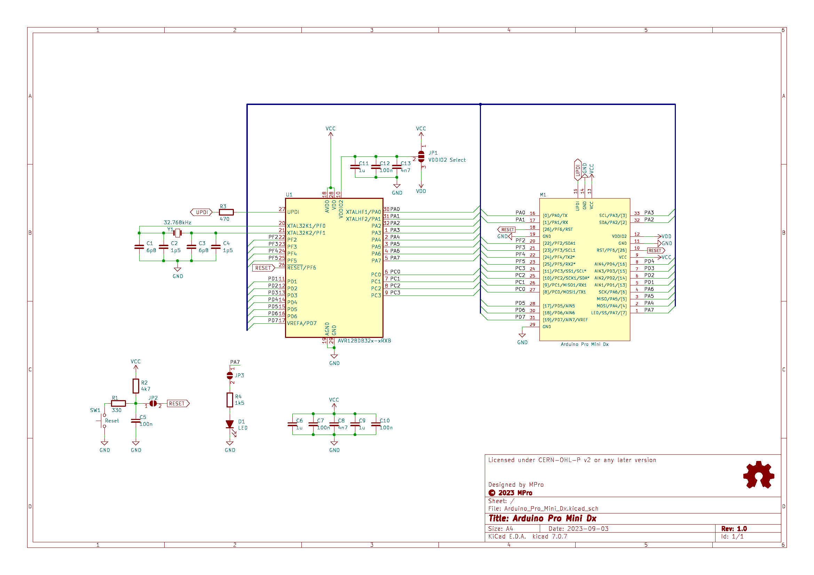
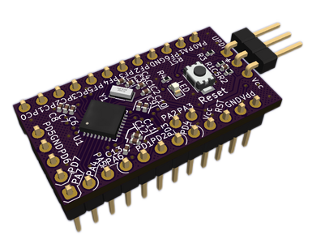

# **Arduino Pro Mini Dx Module**

- [**Arduino Pro Mini Dx Module**](#arduino-pro-mini-dx-module)
  - [**General info**](#general-info)
  - [**Hardware**](#hardware)
  - [**Software**](#software)
  - [**Reporting bugs**](#reporting-bugs)
  - [**License**](#license)
  - [**Support**](#support)

---

## **General info**
Through the use of the Arduino Pro Mini form factor PCB, this module allows easy replacement of modules based on the ATmega328P processor with modern solutions from the AVR Dx family. This allows a significant increase in program size (up to 128kB FLASH) and the use of many new peripherals.

---

## **Hardware**
The module dispenses with the use of an external high-frequency resonator. The clocking of the uC is generated by an internal RC resonator. It has sufficient accuracy for most applications, which can be further improved by internal calibration using the mounted RTC resonator (32768 Hz). This also allows the uC's clock frequency to be changed even during programme execution. 
A dedicated voltage regulator has also been dispensed with, as the uCs of the AVR Dx family operate stably over the full supply voltage range: 1.8-5.5V with a maximum clock frequency of 24MHz.  
Below is a schematic diagram: 

 
and visualisation of the module:

The production files can be found in the location: https://github.com/michpro/Arduino_Pro_Mini_Dx/blob/master/production/

---

## **Software**
The module can be used with any toolchain:
 - Arduino, PlatformIO - [SpenceKonde - DxCore](https://github.com/SpenceKonde/DxCore)
 - or Microchip Studio for AVR®.

The program code is uploaded to the module using the [UPDI programmer](https://github.com/SpenceKonde/DxCore?tab=readme-ov-file#updi-programming).

---

## **Reporting bugs**

[Create an issue on GitHub](https://github.com/michpro/Arduino_Pro_Mini_Dx/issues).

---

## **License**
Copyright © 2023-2025 Michal Protasowicki

Source: https://github.com/michpro/Arduino_Pro_Mini_Dx

This project is released under CERN Open Hardware Licence Version 2 - Permissive.

---

## **Support**
If You find my projects interesting and You wanted to support my work, You can give me a cup of coffee or a keg of beer :)

&nbsp;&nbsp;&nbsp;&nbsp;&nbsp;&nbsp;&nbsp;&nbsp;&nbsp;&nbsp;
